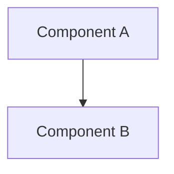

# Spec

Create a spec.md based on the content of $ARGUMENTS and ask clarifying questions where needed.

## Usage
```
spec [file/directory/description]
```

## Instructions

When the user runs this command:

1. **Analyze the provided content** from ARGUMENTS:
   - If ARGUMENTS contains a file path, read and analyze the file
   - If ARGUMENTS contains a directory path, explore the directory structure and key files
   - If ARGUMENTS contains a description or requirements, use that as the basis
   - Extract key concepts to generate a concise, descriptive spec name

2. **Create a comprehensive spec file** at `docs/specs/SPEC_NAME.md` with structured sections for both human readability and LLM parsing:

   **Metadata Section** (YAML frontmatter):
   - Project name, version, status, tags
   - Related files, dependencies, stakeholders
   - Creation date, last updated, review cycle

   **Executive Summary** (Human-focused):
   - 2-3 sentence project description
   - Key business value and success metrics
   - High-level timeline and resource requirements

   **Structured Requirements** (LLM-friendly):
   - **Functional Requirements**: Numbered, testable requirements
   - **Non-functional Requirements**: Performance, security, scalability
   - **User Stories**: Gherkin format (Given/When/Then)
   - **Acceptance Criteria**: Clear pass/fail conditions

   **Technical Architecture**:
   - **System Overview**: ASCII diagram + mermaid syntax
   - **Components**: Structured data with interfaces
   - **Data Models**: Schema definitions with examples
   - **APIs**: Endpoint specifications with request/response examples

   **Implementation Roadmap**:
   - **Phases**: Numbered milestones with deliverables
   - **Dependencies**: Clear prerequisite mapping
   - **Validation Plan**: Automated and manual testing strategies
   - **Success Metrics**: Quantifiable measures

3. **Ask clarifying questions** to fill gaps:
   - Target audience and use cases
   - Technical constraints or preferences
   - Performance requirements
   - Integration requirements
   - Timeline and priority considerations
   - Success criteria and metrics

4. **Structure the spec file** for dual-purpose readability:
   
   **Human-Optimized Format**:
   - Executive summary at top for quick scanning
   - Visual hierarchy with consistent heading levels
   - Bullet points and numbered lists for easy reading
   - Code examples in syntax-highlighted blocks
   - ASCII diagrams for immediate visual understanding
   
   **LLM-Optimized Structure**:
   - YAML frontmatter with structured metadata
   - Consistent section naming with clear delimiters
   - Numbered requirements with unique IDs (REQ-001, REQ-002)
   - Structured data formats (JSON schemas, API specs)
   - Mermaid diagrams for programmatic parsing
   - Tags and categorization for content organization

5. **Iterate based on responses**:
   - Update the spec based on clarifying answers
   - Ask follow-up questions if needed
   - Ensure all sections are complete and actionable

## Parameters

{{#if ARGUMENTS}}
- **ARGUMENTS**: {{ARGUMENTS}}
{{/if}}

## Examples

```
spec "A web application for managing personal tasks with real-time collaboration"
spec ./src/components/UserDashboard.js
spec ./project-requirements.txt
spec "Mobile app for tracking fitness goals with social features"
```

## Notes

**For Human Readers**:
- Executive summary for quick understanding by stakeholders
- Clear business language in overview sections
- Visual elements (diagrams, flowcharts) for complex concepts
- Practical examples and real-world scenarios
- Clear prioritization and phasing

**For LLM Processing**:
- YAML frontmatter with structured metadata for easy parsing
- Consistent section headers and formatting patterns
- Numbered requirements with unique identifiers
- JSON schemas and structured data examples
- Clear relationships between components (dependencies, interfaces)
- Testable acceptance criteria in standardized format
- Tags and categories for content organization

**Quality Standards**:
- Every requirement must be testable and measurable
- Include both positive and negative test cases
- Make assumptions explicit with validation checkpoints
- Provide concrete examples for abstract concepts
- Link to related specifications and dependencies

## File Naming and Location

- **Directory**: `docs/specs/` (create if it doesn't exist)
- **Filename**: Generate from project name/description in kebab-case (2-4 words max)
- **User Confirmation**: Always suggest the filename and ask for approval before creating
- **Examples**: 
  - `docs/specs/task-management-app.md`
  - `docs/specs/user-dashboard-component.md`  
  - `docs/specs/fitness-tracking-mobile.md`
  - `docs/specs/push2type-daemon.md`

## Output Format

The command should:
1. Create `docs/specs/` directory if it doesn't exist
2. Analyze the project description and suggest a short, descriptive spec name in kebab-case
3. Confirm the suggested filename with the user before proceeding
4. Create a well-structured spec file at `docs/specs/SPEC_NAME.md` using the dual-purpose template
5. Ask 3-5 targeted clarifying questions to complete missing sections
6. Offer to refine the spec based on answers
7. Suggest next steps for implementation planning

## Minimal Frontmatter Template

**Required fields only** - keep it simple and actionable:

```yaml
---
name: "Project Name"
status: "draft"
created: "YYYY-MM-DD"
tags: ["main-category"]
---
```

**Field definitions**:
- **name**: Human-readable project name
- **status**: One of `draft`, `review`, `approved`, `implemented`
- **created**: ISO date format (YYYY-MM-DD)
- **tags**: Single primary category (e.g., "feature", "bugfix", "refactor", "api")

**Optional fields** (add only when relevant):
- **stakeholders**: ["role1", "role2"] - who needs to review/approve
- **dependencies**: ["system", "library"] - external requirements
- **related_files**: ["path/to/spec.md"] - linked specifications

## Complete Template Structure

```yaml
---
name: "Project Name"
status: "draft"
created: "YYYY-MM-DD"
tags: ["main-category"]
---

# Project Name

## Executive Summary
[2-3 sentences for stakeholders]

## Requirements

### Functional Requirements
- **REQ-001**: [Testable requirement]
- **REQ-002**: [Testable requirement]

### User Stories
```gherkin
Feature: [Feature name]
  Scenario: [Scenario name]
    Given [context]
    When [action]
    Then [expected outcome]
```

### Acceptance Criteria
- [ ] [Specific, measurable criteria]

## Technical Architecture

### System Overview


### Data Models
```json
{
  "example": {
    "field": "type"
  }
}
```

## Implementation Plan
1. **Phase 1**: [Milestone with deliverables]
2. **Phase 2**: [Milestone with deliverables]

## Validation Strategy
- Unit tests for [specific areas]
- Integration tests for [workflows]
- Performance benchmarks: [metrics]
```